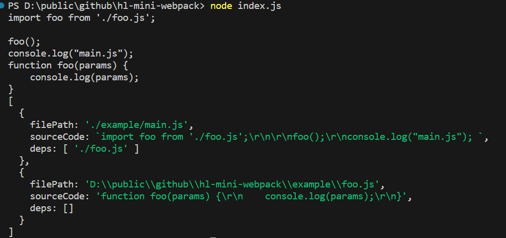
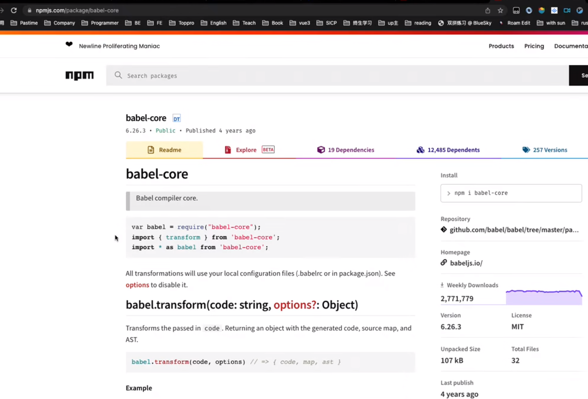

## 实现简单版的webpack 

我们需要获取下面两种才能构建成一个图
1.内容
2.依赖关系
创建 index.js 文件 写主要的逻辑

初始化一下项目  npm init -y
在 package.json 文件中添加type  让我们的代码支持模块
```
"type": "module"
```
在 index.js 文件中 引入fs模块
```
import fs from "fs";

function createAsset() {
  // 获取文件的内容
  // 获取依赖关系

  // readFileSync 读取文件内容
  const sourceCode = fs.readFileSync("./example/main.js", "utf-8");
  console.log(sourceCode);
  return {};
}
createAsset()
```

接下来获取依赖关系
1.可以使用正则表达式来获取
2.使用AST来获取
AST 网址：https://astexplorer.net/
还需要借助几个库:
```
pnpm i @babel/parser 
```
在 index.js 文件中 引入@babel/parser 
```
import parser from "@babel/parser";
...
 // 获取依赖关系
  const ast = parser.parse(sourceCode);
  console.log(ast);
```

报错信息说不认识 import 和 export 需要配置一下 sourceType 就可以获取到 ast 数的根节点
```
parser.parse(sourceCode, {
  sourceType: "module",
});
```
怎么获取import 呢？

也有对应的工具库：@babel/traverse
```
pnpm i @babel/traverse
``` 
在 index.js 文件中 引入@babel/traverse  
并返回依赖关系 deps
```
import fs from "fs";
import parser from "@babel/parser";
import traverse from "@babel/traverse";

function createAsset() {
  // 获取文件的内容

  // readFileSync 读取文件内容
  const sourceCode = fs.readFileSync("./example/main.js", "utf-8");
  console.log(sourceCode);

  // 获取依赖关系
  const ast = parser.parse(sourceCode, {
    sourceType: "module",
  });
  const deps = [];
  traverse.default(ast, {
    // 获取导入的节点
    ImportDeclaration({ node }) {
      deps.push(node.source.value);
    },
  });
  return {
    sourceCode,
    deps,
  };
}
const asset=createAsset();
console.log(asset)
```
输出的依赖关系，以及获取到的文件内容


接下来我们需要生成一个图结构
```
function createGraph() {
  const mainAsset = createAsset("./example/main.js");
  const queue = [mainAsset];
  for (const asset of queue) {
    asset.deps.forEach((relativePath) => {
      const child = createAsset(path.resolve("./example", relativePath));
    
      queue.push(child);
    });
  }
  return queue;
}

console.log(createGraph());
```

基于这个图结构生成最终的文件
那么大概应该涨什么样子尼？按照理解应该包含我们所有的模块
为了互相之间不影响，我们用函数的形式来表示各个模块

接下来我们要处理当前的import语句，将其转换为require语句
esm规范 import 只能在模块的顶层，不能在代码块中使用
所以我们需要将所有的import语句都转换为require语句
利用 cjs的模块思想是运行时加载，所以import语句可以出现在任何地方

接下来我们需要处理所有的require语句，将其转换为模块的引用

再次优化一下结构，增加个立即执行函数，重构之后代码如下

创建模板文件 bundle.ejs
```
(function (modules) {
  function require(filePath) {
    const fn = modules[filePath];
    const module = {
      exports: {},
    };
    fn(require, module, module.exports);
    return module.exports;
  }
  require("./mian.js"); // 启动入口
})({
  "./foo.js": function (require, module, exports) {
    function foo() {}
    module.exports = {
      foo,
    };
  },
  "./main.js": function (require, module, exports) {
    const { foo } = require("./foo.js");
    foo();
    console.log("main.js执行了");
  },
});
```
接下来我们就可以通过ejs 来进行build

安装 pnpm i ejs
通过模板文件 生成对应代码


接下来我们就可以通过babel来进行转换

还需要安装 env 的库
pnpm i babel-preset-env
这样就可以把import 转换成了 require 


我们输出一下 data 
这就是我们生成的templatedata

接下来我们就可以把templatedata 写入到文件中
```
const graph = createGraph();

function build(graph) {
  const template = fs.readFileSync("./bundle.ejs", "utf-8");
  const data = graph.map((asset) => {
    return {
      filePath: asset.filePath,
      code: asset.code,
    };
  });
  const content = ejs.render(template, { data });

  fs.writeFileSync("./dist/bundle.js", content);
}

build(graph);
```
修改模板
```
(function (modules) {
  function require(filePath) {
    const fn = modules[filePath];
    const module = {
      exports: {},
    };
    fn(require, module, module.exports);
    return module.exports;
  }
  require("./mian.js"); // 启动入口
})({
<% data.forEach(info=>{ %>
  "<%- info["filePath"] %>": function (require, module, exports) {
    <%- info["code"] %>;
  },
<% }) %>
});
```
打包后的文件如下，我们又发现一个问题 ，
我们之前是通过require函数来查找 ./foo.js 路径的文件 
现在路径对不上所以我们要修改一下

我们可以设计一下，一个模块给一个唯一id，
这样我们就可以通过id来查找对应的模块
设计结构的时候还可以告诉它依赖关系是什么

接下来我们就要实现这个功能了

修改一下ejs模板 
```
(function (modules) {
  function require(id) {
    const [fn,mapping] = modules[id];
    const module = {
      exports: {},
    };
    function localRequire(name) {
      return require(mapping[name]);
    }
    fn(localRequire, module, module.exports);
    return module.exports;
  }
  require(0); // 启动入口
})({
<% data.forEach(info=>{ %>
  <%- info["id"] %>: [function (require, module, exports) {
    <%- info["code"] %>;
  },<%- JSON.stringify(info["mapping"]) %>],
<% }) %>
});

```
再修改一下代码逻辑
```
import fs from "fs";
import path from "path";
import ejs from "ejs";
import parser from "@babel/parser";
import traverse from "@babel/traverse";
import { transformFromAst } from "@babel/core";

let id = 0;
function createAsset(filePath) {
  // 获取文件的内容

  // readFileSync 读取文件内容
  const sourceCode = fs.readFileSync(filePath, "utf-8");
  console.log(sourceCode);

  // 获取依赖关系
  const ast = parser.parse(sourceCode, {
    sourceType: "module",
  });
  const deps = [];
  traverse.default(ast, {
    // 获取导入的节点
    ImportDeclaration({ node }) {
      deps.push(node.source.value);
    },
  });

  const { code } = transformFromAst(ast, null, {
    presets: ["env"],
  });
  return {
    filePath,
    code,
    deps,
    id: id++,
    mapping: {},
  };
}
// const asset=createAsset();
// console.log(asset)

function createGraph() {
  const mainAsset = createAsset("./example/main.js");
  const queue = [mainAsset];
  for (const asset of queue) {
    asset.deps.forEach((relativePath) => {
      const child = createAsset(path.resolve("./example", relativePath));
      asset.mapping[relativePath] = child.id;
      // 深度优先遍历
      queue.push(child);
    });
  }
  return queue;
}

// console.log(createGraph());
const graph = createGraph();

function build(graph) {
  const template = fs.readFileSync("./bundle.ejs", "utf-8");
  const data = graph.map((asset) => {
    return {
      filePath: asset.filePath,
      code: asset.code,
      mapping: asset.mapping,
    };
  });
  const content = ejs.render(template, { data });

  fs.writeFileSync("./dist/bundle.js", content);
}

build(graph);
```